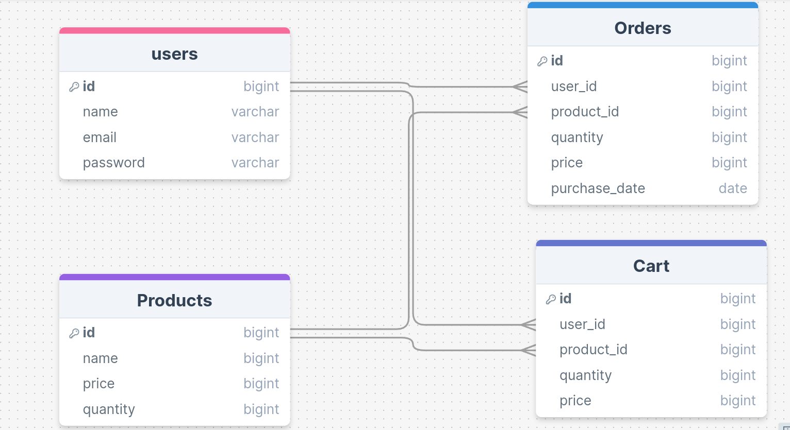

# E-commerce

## Database Schema

* For Interactive view [Click Here](https://drawsql.app/teams/myspace-4/diagrams/ecommerce)

## How to Setup
* Node JS Version used is `21.7.1`
* Step 1 : Clone the repo
* Step 2 : Install dependencies
```shell
 npm install 
 ```
* Step 3 : Make sure db-migrate dependency is installed globally.

```shell
 npm install -g db-migrate
 ```

 * Step 4: Create the .env file

```text
POSTGRES_HOST=localhost
POSTGRES_DB=DB_NAME
POSTGRES_USER=DB_USER_NAME
POSTGRES_PASSWORD=DB_USER_PASS
POSTGRES_PORT=PORT_NO
SECRET_KEY='yoursecret code' 
```

* Step 5: Update same above information in `databse.json` file for migration purpose.
* Step 6: Run the migrations command.

```shell
db-migrate up
```

* Step 7: Start the Server using command.
```shell
npm start
```

Thanks 😀️